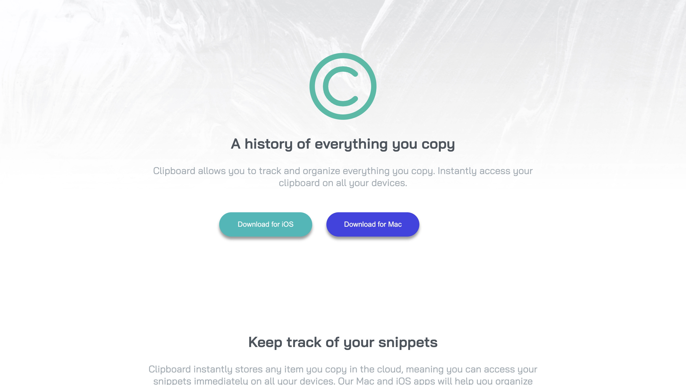

# Frontend Mentor - Clipboard landing page solution

This is a solution to the [Clipboard landing page challenge on Frontend Mentor](https://www.frontendmentor.io/challenges/clipboard-landing-page-5cc9bccd6c4c91111378ecb9). Frontend Mentor challenges help you improve your coding skills by building realistic projects. 

## Table of contents

- [Overview](#overview)
  - [The challenge](#the-challenge)
  - [Screenshot](#screenshot)
  - [Links](#links)
- [My process](#my-process)
  - [Built with](#built-with)
  - [What I learned](#what-i-learned)
  - [Continued development](#continued-development)
  - [Useful resources](#useful-resources)
- [Author](#author)
- [Acknowledgments](#acknowledgments)

## Overview

### The challenge

Users should be able to:

- View the optimal layout for the site depending on their device's screen size
- See hover states for all interactive elements on the page

### Screenshot

### Links

- Solution URL: [oluwaCKA.github.io/Clipboard-landing-page](https://oluwaCKA.github.io/Clipboard-landing-page)
- Live Site URL: [oluwaCKA.github.io/Clipboard-landing-page](https://oluwaCKA.github.io/Clipboard-landing-page)

## My process

### Built with

- Semantic HTML5 markup
- CSS custom properties
- Flexbox

### What I learned

I learned about columns property in CSS, been my very first time of using it, I am so elated.

### Continued development

I'd like to know more about media queries, especially responsiveness for smaller  screens, I'm still confused on the width to use when it comes to smaller screens
I will definitely work on that.

### Useful resources

- [Stack overflow](https://www.stackoverflow.com) - This helped me for responsivess questions and answers. I really liked this pattern and will use it going forward.
- [W3Schools](https://www.w3schools.com) - This is an amazing website which helped me finally understand columns property in css. I'd recommend it to anyone still learning this concept.

## Author

- Website - [Segun Okedele](https://www.segunokedele.com)
- Frontend Mentor - [@oluwaCKA](https://www.frontendmentor.io/profile/oluwaCKA)
- Twitter - [@oluwa_CKA](https://www.twitter.com/oluwa_CKA)

## Acknowledgments

I'd like to thank my mentor, Dev Olagboye, he helped me with some questions bothering my mind while doing the challenge, and also thank myself for being an inspiration to myself.
